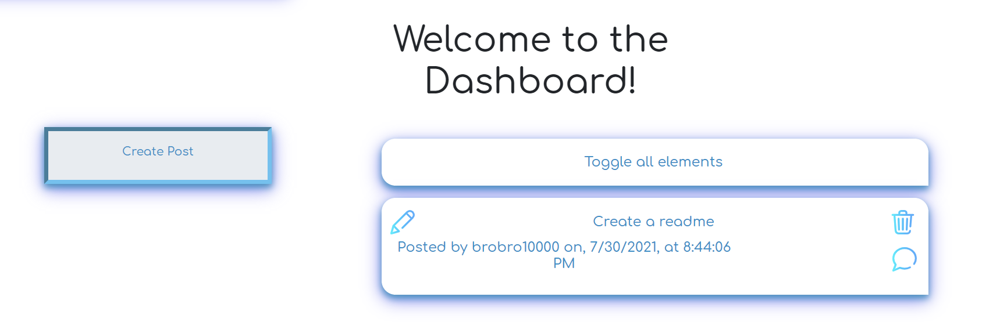

# Repository of Thought - ROT here

## **ROT**
Repository of Thought is a technology blog allowing you to leave your comments and letting them ROT there! 

- When you arrive on the page, you are met with a series of post by other users.

- Going to the login page, we can create an account

- Clicking on the comments image on the bottom right drops down the series of comments left by the users, as well as the ability to leave comments, but first we have to log in

- By default, the background is set to neutral but a dynamic background toggle is there for the user. 

- On login, we are taken to the dashboard where we can delete and create the post from our own account. 

- Clicking the create post drops down a text box allowing us to create a new post. 

- Hitting create, creates the post. We can click the title to drop down the contents of the post. 

- Our post is dropped to the bottom of the page in the home page. 

- If we are logged in, we can press the plus sign and log into the site

- Hitting the trashcan allows us to delete the post

# Why it Matters?
The tech blog or Repository of Thought is an exercise of everything we have learned to be a full stack developer. Utilizing all the skills, we made a miniature blog post. This is the first stepping stone towards a fulfilling career as a full stac developer!

Visit Repository of Thought [by clicking here](https://repository-of-thought.herokuapp.com/index) or follow the direct link at [https://repository-of-thought.herokuapp.com/index](https://repository-of-thought.herokuapp.com/). 

## 
We Hope to see you there!
 ##
